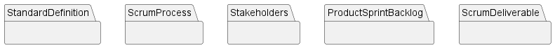

# 📕Documentation

## 🌀 Project's Package Model

### 📲 Modules
* **[StandardDefinition](./standarddefinition/)** :Standard Concepts
* **[ScrumProcess](./scrumprocess/)** :Subontology addresses the events that occur in a project that adopts Scrum, such as the Scrum ceremonies
* **[Stakeholders](./stakeholders/)** :Concerns the teams, agents and roles involved in a Scrum project
* **[ProductSprintBacklog](./productsprintbacklog/)** :Addresses aspects related to the requirements established in a Scrum project and activities planned to materialize them
* **[ScrumDeliverable](./scrumdeliverable/)** :Focuses on the results produced during a Scrum project

