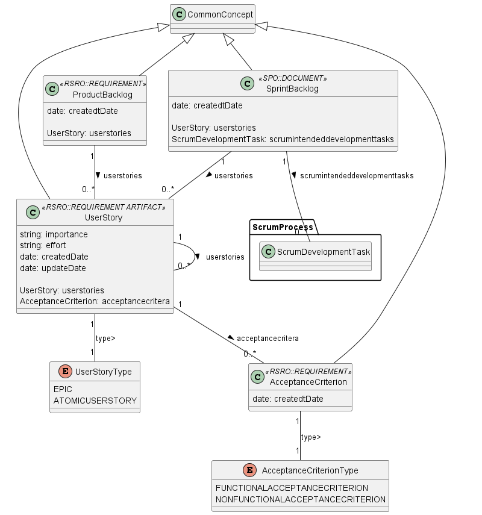

# 📕Documentation: ProductSprintBacklog

Addresses aspects related to the requirements established in a Scrum project and activities planned to materialize them

## 🌀 Package's Data Model

### ⚡Entities

* **UserStory** : A Requirement Artifact that describes Requirements in a Scrum Project.
* **AcceptanceCriterion** : Requirements used to verify if the User Story was developed correctly and meets the client needs.
* **ProductBacklog** : A Document that contains the requirements of the product to be developed in the Scrum Project
* **SprintBacklog** : A Document that describes the Sprint planning
