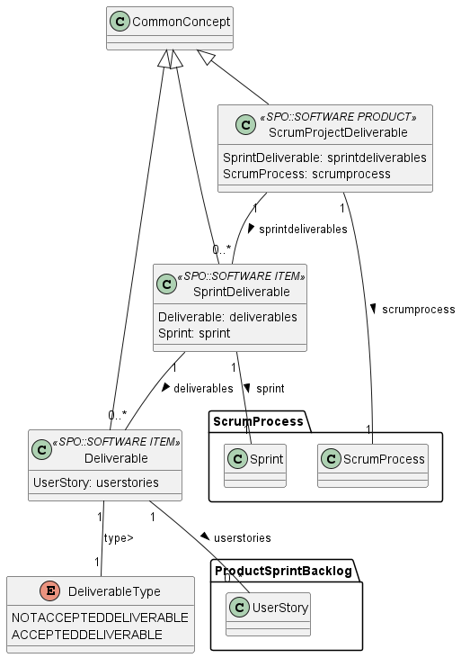

# 📕Documentation: ScrumDeliverable

Focuses on the results produced during a Scrum project

## 🌀 Package's Data Model

### ⚡Entities

* **Deliverable** : Is evaluated considering the Acceptance Criteria related to the User Stories it materializes.
* **SprintDeliverable** : Accepted Deliverables produced in a Sprint are integrated forming a more complex and complete Software Item called Sprint Deliverable, which is the Sprint result delivered to the client
* **ScrumProjectDeliverable** : Scrum Project Deliverable is a Software Product and, as such, it is composed of (i) one or more Software Items (e.g., programs) working together for satisfying certain needs, and (ii) other items to support the Software Product use or maintenance, such as documentation
