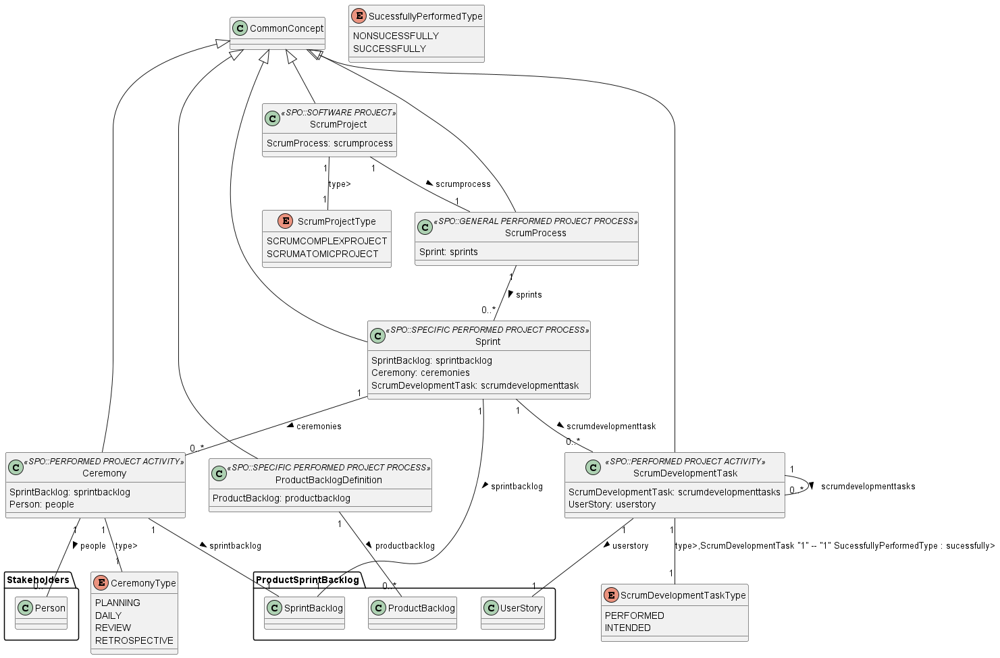

# 📕Documentation: ScrumProcess

Subontology addresses the events that occur in a project that adopts Scrum, such as the Scrum ceremonies

## 🌀 Package's Data Model

### ⚡Entities

* **ScrumProject** : Is a Software Project that adopts Scrum in its process (Scrum Process).
* **ScrumProcess** : Is a General Performed Project Process (i.e., it is an overall process performed in a project) composed        of two types of Specific Performed Project Process.
* **ProductBacklogDefinition** : Aims at defining and prioritizing the functionalities to be produced in the Scrum Project.
* **Sprint** : A time-box used to perform a project activity.
* **Ceremony** : The ceremonies that compose a Sprint are Planning Meeting, Daily Standup Meeting, Review Meeting and Retrospective Meeting.
* **ScrumDevelopmentTask** : Is a Performed activity in a Scrum Project.
