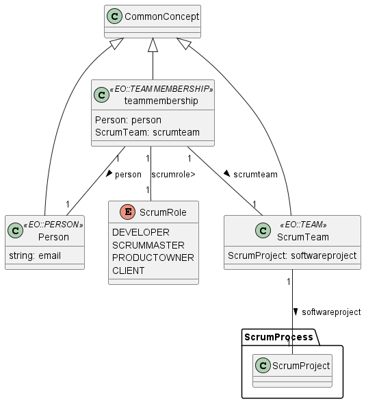

# 📕Documentation: Stakeholders

Concerns the teams, agents and roles involved in a Scrum project

## 🌀 Package's Data Model

### ⚡Entities

* **Person** : A Person that performs a role in a scrum project
* **teammembership** : Relation between Person and Team
* **ScrumTeam** : A Team in a Scrum project
